Icon file name|Icon
---|---
adobe-after_effects.svg|
adobe-animate.svg|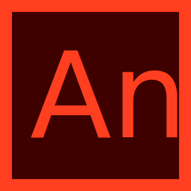
adobe-dreamweaver.svg|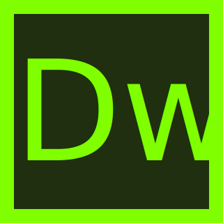
adobe-illustrator.svg|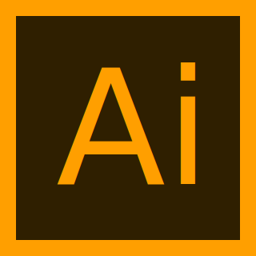
adobe-indesign.svg|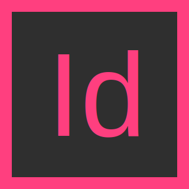
adobe-lightroom.svg|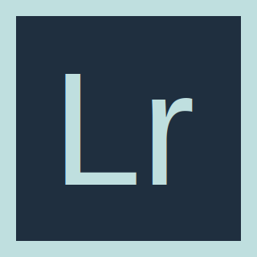
adobe-muse.svg|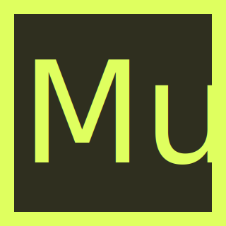
adobe-photoshop.svg|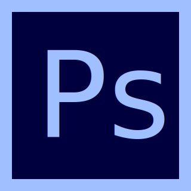
adobe-premiere_pro.svg|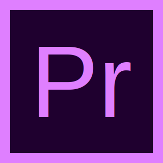
angular-css.svg|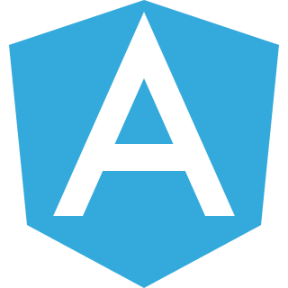
angular-html.svg|
angular-javascript.svg|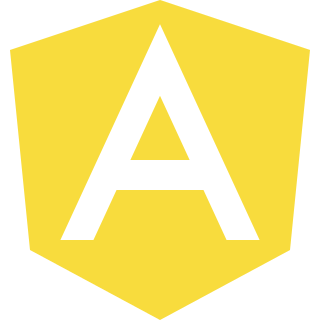
angular-module.svg|
angular-sass.svg|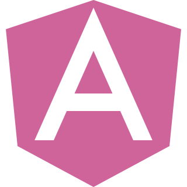
angular-spec.svg|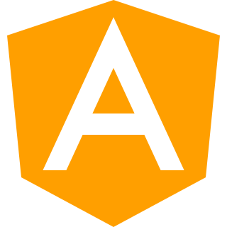
angular-typescript.svg|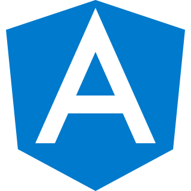
angular.svg|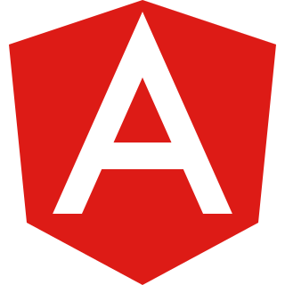
ansible.light.svg|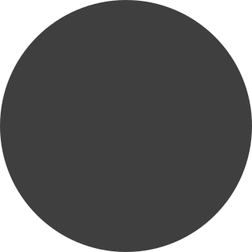
ansible.svg|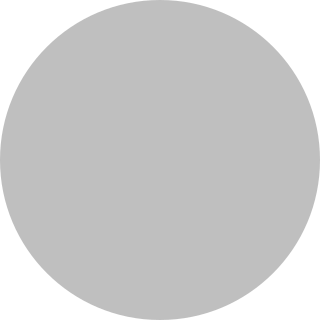
apache.svg|
api_blueprint.svg|
appveyor.svg|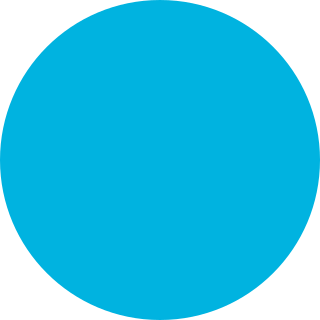
archlinux.svg|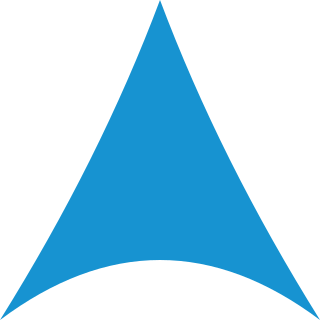
astro.light.svg|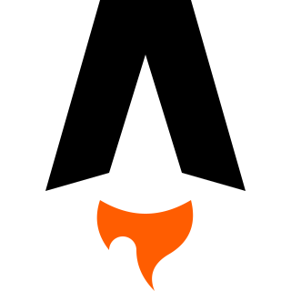
astro.svg|
azure.svg|
azure_pipelines.svg|
babel.svg|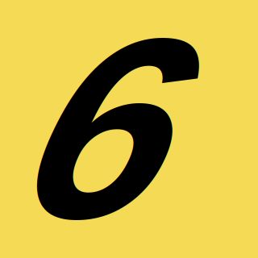
blade.svg|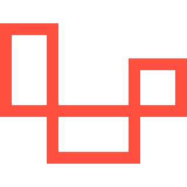
bolt.svg|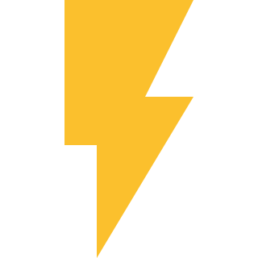
bower.svg|
build-coffeescript.svg|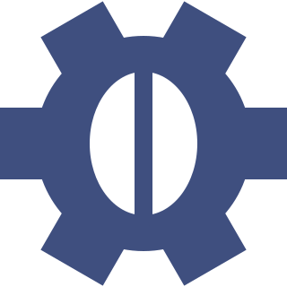
build-d.svg|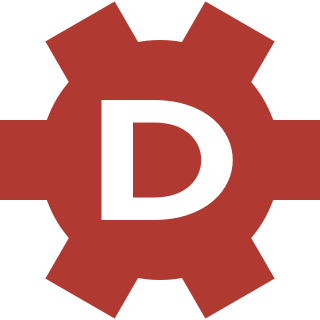
build-idris.svg|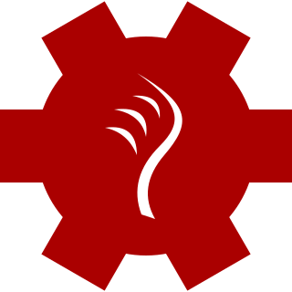
build-nodejs.svg|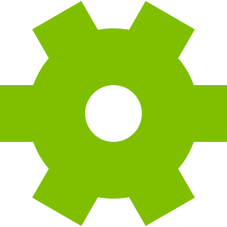
build-ruby.svg|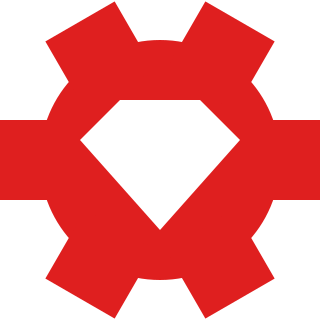
build-swift.svg|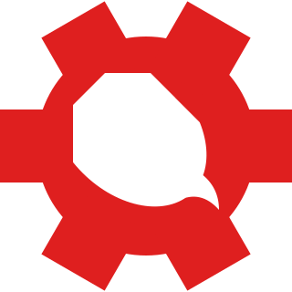
build.svg|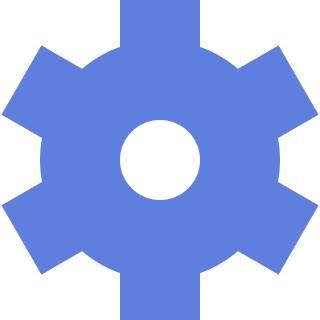
c.svg|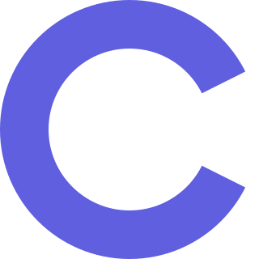
camelia.svg|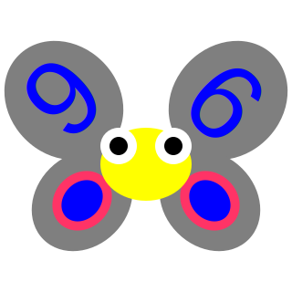
circleci.light.svg|
circleci.svg|
clojure.svg|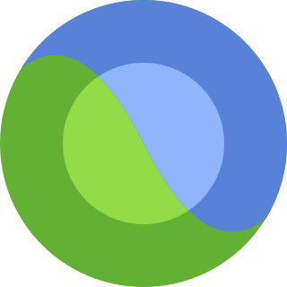
cmake.svg|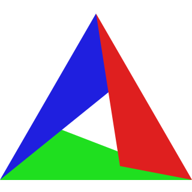
codeclimate.light.svg|
codeclimate.svg|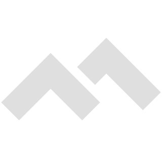
codecov.svg|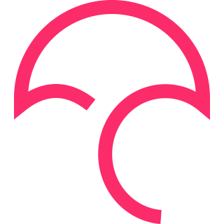
coffeescript.svg|
config-graphql.svg|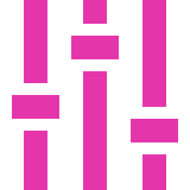
config-javascript.svg|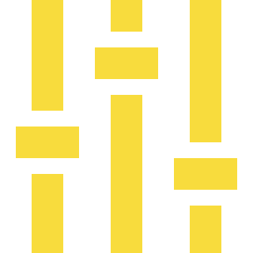
config-nim.svg|
config-postcss.svg|
config-typescript.svg|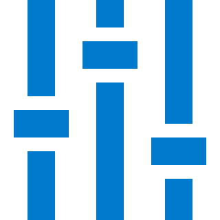
config.light.svg|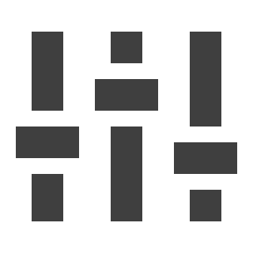
config.svg|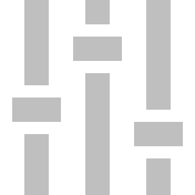
console.light.svg|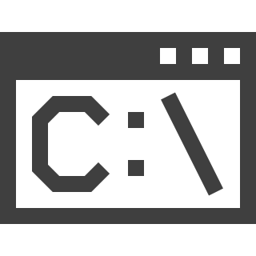
console.svg|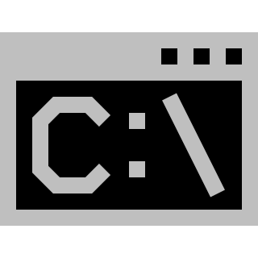
contribution.light.svg|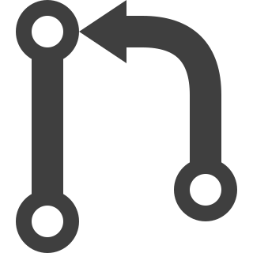
contribution.svg|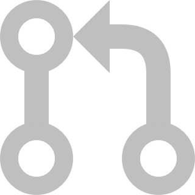
cpp.svg|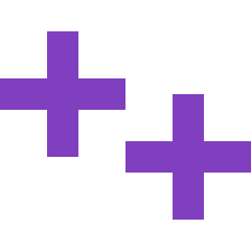
crystal-chevrons.light.svg|
crystal-chevrons.svg|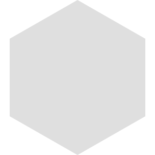
crystal.light.svg|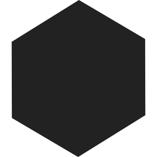
crystal.svg|
csharp.svg|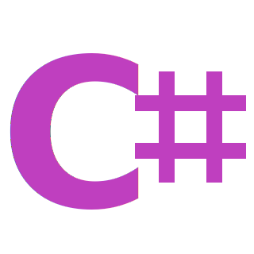
css.svg|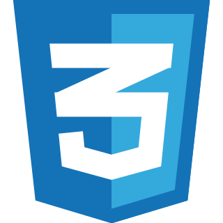
csscomb.svg|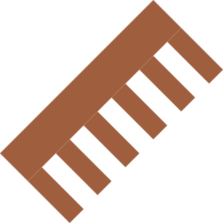
cucumber.svg|
cuda.svg|
d.svg|
dart.svg|
database.light.svg|
database.svg|
directx.svg|
disc.svg|
docker.svg|
dotnet.svg|
dune-build.svg|
editorconfig.svg|
elixir.svg|
elm.svg|
ensime.svg|
erlang.svg|
eslint.svg|
favicon.svg|
file-binary.svg|
file-csv.svg|
file-diff.svg|
file-doxygen.svg|
file-git.svg|
file-json-haxe.svg|
file-json.svg|
file-pdf.svg|
file-swift.svg|
file-text.svg|
file-toml-rust.svg|
file-toml.svg|
file-xml-csharp.svg|
file-xml-css.svg|
file-xml-gnome.svg|
file-xml.svg|
file-yaml.svg|
file.svg|
firebase.svg|
flash.svg|
flow.svg|
folder-bower.svg|
folder-build.svg|
folder-ci.svg|
folder-css.svg|
folder-d.svg|
folder-font.svg|
folder-git.svg|
folder-haxe.svg|
folder-html.svg|
folder-image.svg|
folder-javascript.svg|
folder-locale.svg|
folder-nodejs.svg|
folder-nuget.svg|
folder-paket.svg|
folder-python.expanded.svg|
folder-python.svg|
folder-root.svg|
folder-source.svg|
folder-test.svg|
folder-typescript.svg|
folder-visual_studio.svg|
folder-vscode.svg|
folder.expanded.svg|
folder.svg|
font.light.svg|
font.svg|
fsharp.svg|
fusebox.svg|
gamemaker.svg|
gamemaker2.light.svg|
gamemaker2.svg|
git.svg|
gitlab.svg|
gnome.svg|
go.svg|
godot.svg|
gradle.svg|
graphql.svg|
groovy.svg|
grunt.svg|
gulp.svg|
haml.svg|
handlebars.svg|
haskell.svg|
haxe-chevrons.svg|
haxe.svg|
haxedevelop.svg|
html.svg|
idris.svg|
image.svg|
info.svg|
ionic.svg|
java.svg|
javascript-chevrons.svg|
javascript-lint.svg|
javascript-test.svg|
javascript.svg|
jekyll.light.svg|
jekyll.svg|
julia.svg|
karma.svg|
kotlin.svg|
less.svg|
lib-idris.svg|
lib-locale.svg|
lib-python.svg|
lib-rust.svg|
lib.svg|
libreoffice-base.svg|
libreoffice-calc.svg|
libreoffice-draw.svg|
libreoffice-impress.svg|
libreoffice-math.svg|
libreoffice-writer.svg|
licence.svg|
liquid.light.svg|
liquid.svg|
lisp.svg|
locale.svg|
lock-rust.svg|
lock.svg|
lua.svg|
map-css.light.svg|
map-css.svg|
map-javascript.light.svg|
map-javascript.svg|
markdown.light.svg|
markdown.svg|
marko-javascript.svg|
marko.svg|
mdx.light.svg|
mdx.svg|
meson.svg|
mjml.svg|
msoffice-access.svg|
msoffice-excel.svg|
msoffice-onenote.svg|
msoffice-powerpoint.svg|
msoffice-word.svg|
nim.light.svg|
nim.svg|
nodejs-lock.svg|
nodejs.svg|
npm.svg|
nsis.svg|
nuget.svg|
nunjucks.svg|
objective_c.svg|
ocaml.svg|
package-archlinux.svg|
package-debian.svg|
package-nuget.svg|
package-rpm.svg|
package-vscode.svg|
package.svg|
paket.svg|
php.svg|
point_cloud_library.svg|
polymer.svg|
postcss.svg|
posthtml.svg|
powershell.svg|
protractor.svg|
pug.svg|
puppet.svg|
python.svg|
r.svg|
raml.svg|
razor.svg|
react.svg|
reason.svg|
registry.svg|
rspec.svg|
ruby-chevrons.svg|
ruby.svg|
rubygem.svg|
rust.svg|
salesforce-chevrons.svg|
salesforce.svg|
sass.svg|
save.svg|
scala.svg|
scheme.svg|
sequalize.svg|
simple_build_tool.svg|
simple_declarative_language.svg|
solidity.svg|
sound.svg|
stylelint.light.svg|
stylelint.svg|
stylus.svg|
svelte.svg|
svg.svg|
swift.svg|
tailwind.svg|
terminal.light.svg|
terminal.svg|
terraform.svg|
trash.svg|
travis.svg|
twig.svg|
typescript-lint.svg|
typescript-test.svg|
typescript.svg|
unity.light.svg|
unity.svg|
v.svg|
vagrant.svg|
vibed.svg|
video.svg|
visual_basic.svg|
visual_studio.svg|
vscode.svg|
vue.svg|
webassembly.svg|
webpack.svg|
yarn.svg|
